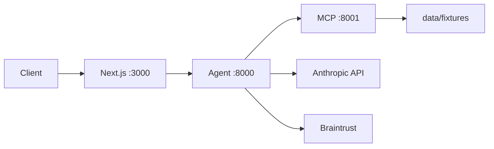

# Deploying Verity

Two-service deployment: **MCP** (tools) + **Agent** (LangGraph/FastAPI). Deploy MCP first, then point the agent at its URL.

Target platforms: [Railway](https://railway.app) (recommended), Render, or Modal.

## Prerequisites

- Anthropic API key
- Braintrust API key (for tracing)
- Railway account (or equivalent)

## 1. Deploy MCP server

Create a Railway service from this repo:

| Setting | Value |
|---|---|
| Root directory | `/` (repo root) |
| Config file | `services/mcp/railway.toml` |
| Dockerfile | `services/mcp/Dockerfile` |

**Environment variables:**

```
MCP_HOST=0.0.0.0
MCP_PORT=8001
VERITY_REPO_ROOT=/app
```

Note the public or internal URL (e.g. `https://verity-mcp.up.railway.app/mcp`).

## 2. Deploy agent service

Create a second Railway service:

| Setting | Value |
|---|---|
| Config file | `services/agent/railway.toml` |
| Dockerfile | `services/agent/Dockerfile` |

**Environment variables:**

```
ANTHROPIC_API_KEY=<your-key>
MCP_SERVER_URL=https://<mcp-service>/mcp
BRAINTRUST_API_KEY=<your-key>
BRAINTRUST_PROJECT=verity
AGENT_API_KEY=<shared-secret>
AGENT_HOST=0.0.0.0
AGENT_PORT=8000
VERITY_REPO_ROOT=/app
```

Health check: `GET /health` (no auth)

Test reconciliation:

```bash
curl -X POST https://<agent-service>/reconcile \
  -H "Content-Type: application/json" \
  -H "Authorization: Bearer <shared-secret>" \
  -d '{"fixture_id": "nextera-systems"}'
```

## 3. Braintrust traces

Every `/reconcile` run creates a top-level span. Nested spans include:

- LangGraph pipeline nodes (via Braintrust auto-instrumentation)
- Claude model calls
- MCP tool calls (`mcp.parse_invoice`, `mcp.reconcile`, etc.)

View traces at [braintrust.dev](https://www.braintrust.dev) in the configured project.
The dashboard shows that runs are traced; public deep links require project read access.

Tracing is optional locally — if `BRAINTRUST_API_KEY` is unset, the agent runs normally without logging.

## 4. Deploy frontend (Vercel)

Deploy **after** the agent is live on Railway — the Next.js app proxies API calls to `AGENT_API_URL`.

### Vercel project settings

| Setting | Value |
|---|---|
| Root directory | `apps/web` |
| Framework | Next.js (auto-detected) |
| Install command | `npm install --prefix ../../packages/shared/ts && npm install` |
| Build command | `npm run build` |

`vercel.json` in `apps/web/` sets these by default.

### Environment variables (Vercel)

```
AGENT_API_URL=https://<your-railway-agent-service>
AGENT_API_KEY=<same-shared-secret-as-agent>
```

No Anthropic or Braintrust keys on Vercel — the frontend never calls Claude directly; it proxies to the agent service. `AGENT_API_KEY` is server-side only (not `NEXT_PUBLIC_`).

### Smoke test

```bash
curl https://<your-vercel-app>/api/reconcile \
  -H "Content-Type: application/json" \
  -d '{"fixture_id": "nextera-systems"}'
```

Open the deployed dashboard and run reconciliation (requires `BRAINTRUST_API_KEY` on the agent for tracing).

### CORS / networking

The Next.js API route (`/api/reconcile`) calls the agent server-side, so browser CORS is not an issue. Ensure the Railway agent URL is reachable from Vercel's build/runtime network (public Railway URL works).

## Local Docker smoke test

From repo root:

```bash
docker build -f services/mcp/Dockerfile -t verity-mcp .
docker build -f services/agent/Dockerfile -t verity-agent .

docker run --rm -p 8001:8001 verity-mcp
docker run --rm -p 8000:8000 \
  -e ANTHROPIC_API_KEY=$ANTHROPIC_API_KEY \
  -e MCP_SERVER_URL=http://host.docker.internal:8001/mcp \
  verity-agent
```

## Architecture


